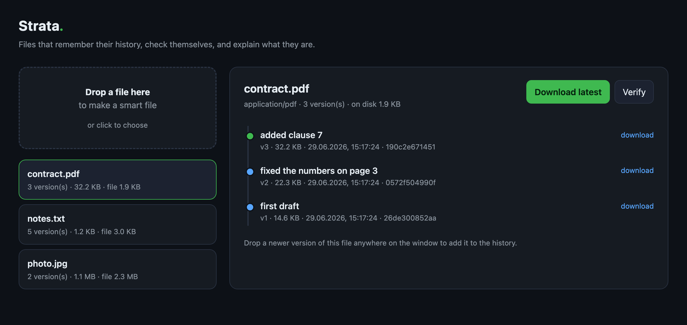

# Strata — the smart-file format

> A plain file forgets. It does not know what it used to be, it cannot tell
> when it has been damaged, and it cannot explain what it is. **Strata** is a
> single, portable file that *remembers its history, verifies itself, and
> describes itself* — and carries all of that with it when you copy or send it.

Strata is to an ordinary file what a copy-on-write filesystem (btrfs / ZFS) is
to FAT: the same bytes, but now they have **snapshots, checksums, and
self-description** built in — at the level of *one file*, not the disk.

```
ordinary file:   [ bytes ]                      (forgets everything)

strata file:     [ bytes of v3 ]
                 + v1, v2 history (deduplicated)
                 + a checksum for every chunk
                 + "I am a PDF named contract.pdf, made by …, notes: …"
```

The reference implementation is **pure Python, zero dependencies**.

---

## Why this doesn't exist yet (and why it should)

Version history, integrity, and self-description all exist today — but only
*outside* the file:

| Capability        | Where it lives today            | Problem |
|-------------------|---------------------------------|---------|
| version history   | git, Dropbox, Google Drive      | lost the moment you copy/email the file |
| integrity         | ZFS/btrfs, `sha256sum` sidecars | lives in the filesystem or a separate file |
| self-description  | app-specific metadata, EXIF/XMP | format-specific, often stripped |

The history of *your* `contract.pdf` is stranded in *your* cloud. Send the file
to someone and all of it evaporates. Strata moves these capabilities **into the
file itself**, format-agnostically, so they survive the trip.

This is a genuinely empty niche. ZFS/btrfs work at the *volume* level; IPFS is a
*distributed system*; LibreOffice "Save Version" is locked to one app and one
format; RCS keeps separate `,v` files. None of them is *one portable file, for
any payload, that carries its own past*. See [`SPEC.md`](SPEC.md) and the
[design article](docs/ARTICLE.md).

## Install

```bash
pip install -e .        # from this repo; pure stdlib, nothing to compile
```

## The easy way: the drag-and-drop app

No terminal needed after launch. Run once:

```bash
strata gui
```

A local app opens in your browser. **Drop a file** to turn it into a smart
file. **Drop a newer version** onto it to add to its history. Click any version
to download it. One button **verifies** the file and offers to **repair** it if
it's damaged. Everything stays on your machine (`~/StrataFiles`).



## Power user: the CLI

```bash
# wrap any file into a versioned, self-verifying container
strata wrap contract.pdf -o contract.strata -m "first draft"

# later: record a new version — only the changed chunks are stored
strata commit contract.strata contract.pdf -m "added clause 7"

# see the history that now travels inside the file
strata log contract.strata
#  v1  ec844dc5af31  2026-06-29 04:14:09   210 KiB  first draft
# * v2  30c76e05ff97  2026-06-29 05:01:22   212 KiB  added clause 7

# what is this file?  (self-description)
strata info contract.strata

# check every byte against its checksum
strata verify contract.strata

# get any past version back, exactly
strata checkout contract.strata -n 0 -o contract_v1.pdf

# footer damaged by a bad transfer?  rebuild it from the intact log
strata repair contract.strata
```

## Quick start (library)

```python
from strata import Strata

s = Strata.create("notes.strata", b"first version", mime="text/plain",
                  name="notes.txt", message="start")
s.commit(b"first version, now longer", message="expand")

print([v.message for v in s.versions()])   # ['start', 'expand']
print(s.read(0))                           # b'first version'  (old version)
print(s.read(-1))                          # b'first version, now longer'

report = s.verify()
print(report.ok, report.blobs_checked)     # True 2
```

## What's inside (the four properties)

- **Versioned, deduplicated history.** Content-defined chunking + content
  addressing means a new version stores only what changed. Append-only commits
  are the copy-on-write equivalent of cheap snapshots.
- **Self-verifying.** Every chunk is addressed by its BLAKE2b-256 hash; the
  footer is checksummed. `strata verify` recomputes everything and tells you
  exactly which versions are still intact.
- **Self-describing.** MIME type, original name, author, and timestamps live
  inside the file. `strata info` answers "what is this?" without any external
  app.
- **Recoverable.** Append-only writes mean a torn write or a damaged footer can
  be rebuilt from the intact log (`strata repair`).

## Security model

Strata is an **integrity** format, not an **authenticity** format. Understand
what that means before relying on it:

| What Strata does | What Strata does not do |
|------------------|------------------------|
| Detects accidental corruption — bit-rot, truncation, bad transfers | Detect a deliberate replacement: an adversary with write access can rebuild a valid Strata file from scratch with different content and correct hashes |
| Tells you *which* versions survived damage | Prove the content came from a specific author |
| Lets you recover from a torn write | Encrypt the payload |

If you need *authenticity* (tamper-detection against a motivated attacker or
proof of authorship), sign the Strata file with a separate tool (e.g. `gpg`,
`minisign`, or Sigstore). That is intentionally out of scope for the format;
Strata focuses on the "reliable memory" problem, not the "trust" problem. See
[`SPEC.md` §7](SPEC.md) for the full threat-model discussion.

## Status & roadmap

v0.1 (this repo) is a complete, tested reference implementation of **Strata
format v1**. Reserved for later versions: Reed–Solomon parity for *correcting*
(not just detecting) corruption, payload encryption, and branching/merge
commits. See [`SPEC.md` §8](SPEC.md).

## Project layout

```
strata/        reference implementation (format, chunker, core API, CLI)
tests/         test suite — doubles as a conformance check
examples/      runnable demo
SPEC.md        the byte-level format specification
docs/ARTICLE.md  the "why" — design rationale and prior art
```

## License

Apache-2.0. See [`LICENSE`](LICENSE). The format specification is intended to
be freely implementable by anyone.
